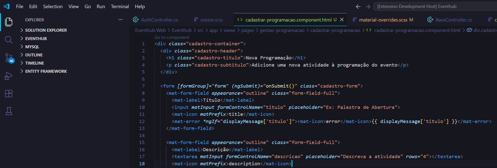
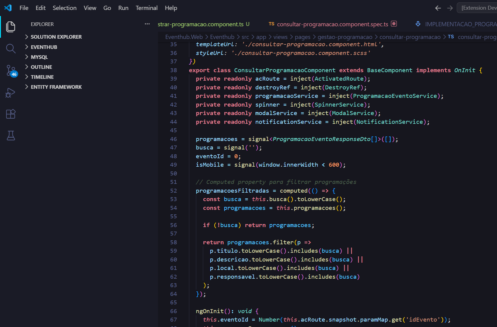
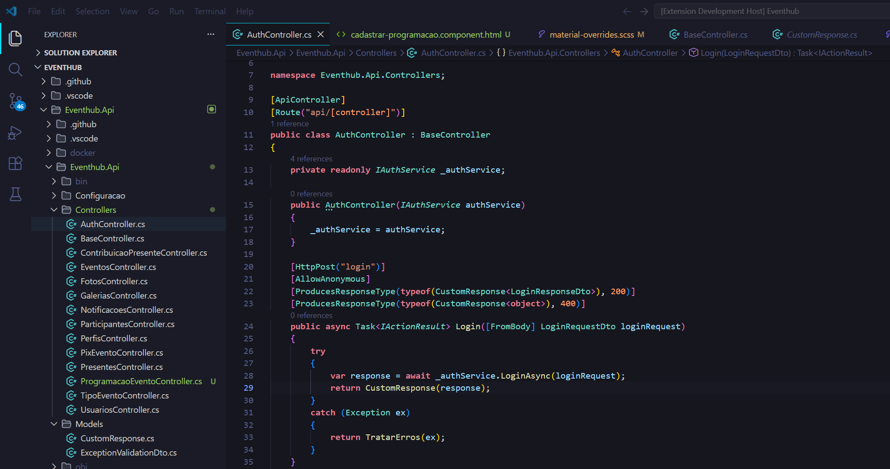
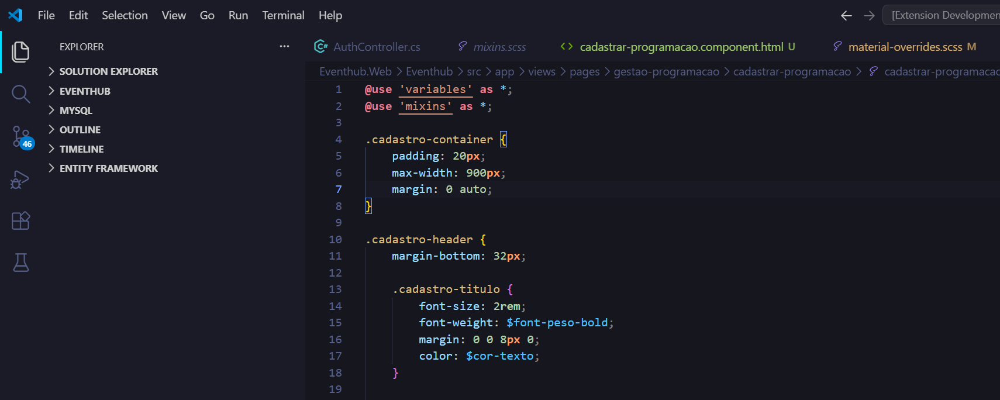

# Neon Storm Theme 🎨⚡

**Ultra-vivid dark theme optimized for Angular and .NET development**

Neon Storm is a vibrant, high-contrast VS Code theme designed specifically for Angular and .NET developers who want maximum color saturation and eye-catching syntax highlighting. Features electric cyan accents and neon-bright syntax colors.



## ✨ Features

- **🔥 Ultra-Vivid Colors** — Maximum saturation for high-impact syntax highlighting
- **⚡ Angular Optimized** — Perfect for HTML templates, TypeScript, and SCSS
- **🎯 .NET Focused** — Excellent C# support with clear attribute and type highlighting
- **💎 Neon Accents** — Electric cyan active tab borders and selection highlights
- **🌈 High Contrast** — Easy differentiation between keywords, types, functions, and variables

## 🎨 Color Palette

### Syntax Highlighting

| Token Type | Color | Hex |
|------------|-------|-----|
| **Keywords** (public, class, return, export) |  | `#F7768E` |
| **Functions/Methods** (loadEvents, CustomResponse) |  | `#E0AF68` |
| **Types/Classes** (UserService, ActionResult) |  | `#73DACA` |
| **Variables/Parameters** |  | `#7AA2F7` |
| **Strings** |  | `#9ECE6A` |
| **Decorators/Attributes** (@Injectable, [Route]) |  | `#BB9AF7` |
| **Numbers/Constants** |  | `#FF9E64` |
| **Comments** |  | `#4A5F4A` |

### UI Colors

| Element | Color | Hex |
|---------|-------|-----|
| **Editor Background** |  | `#16161E` |
| **Sidebar Background** |  | `#1A1B26` |
| **Terminal Background** |  | `#121217` |
| **Active Tab Border** |  | `#00DFFF` |
| **Selection** |  | `#263545` |
| **Cursor** |  | `#00DFFF` |

## 🚀 Installation

### From Source (Development)

1. Clone or download this repository
2. Copy the folder to your VS Code extensions directory:
   - **Windows**: `%USERPROFILE%\.vscode\extensions`
   - **macOS/Linux**: `~/.vscode/extensions`
3. Restart VS Code
4. Go to: `File` → `Preferences` → `Theme` → `Color Theme`
5. Select **Neon Storm**

### Testing the Theme

1. Open the theme folder in VS Code
2. Press `F5` to launch Extension Development Host
3. In the new window, select the theme from the Command Palette (`Ctrl+Shift+P` → "Preferences: Color Theme")

## 📁 Optimized For

This theme provides exceptional syntax highlighting for:

### Angular
- ✅ **HTML** — Tags in pink (`#F7768E`), attributes in purple (`#BB9AF7`)
- ✅ **TypeScript** — Decorators (`@Component`, `@Injectable`) in purple, types in turquoise
- ✅ **SCSS/CSS** — Selectors in turquoise, properties in blue, values in gold
- ✅ **Template Syntax** — `*ngIf`, `*ngFor`, `[routerLink]` highlighted as attributes
- ✅ **Interpolation** — `{{ }}` expressions in blue

### .NET (C#)
- ✅ **Keywords** — `public`, `class`, `using`, `return` in pink
- ✅ **Types** — `ActionResult`, `CustomResponse`, interfaces in turquoise
- ✅ **Attributes** — `[Route]`, `[HttpGet]`, `[ApiController]` in purple
- ✅ **Methods** — Function names in gold with bold styling
- ✅ **Generics** — `List<T>`, `Task<TResult>` properly highlighted

### Configuration Files
- ✅ **JSON** — Keys in turquoise, strings in green, numbers in orange
- ✅ **Markdown** — Headings in pink, links in turquoise, code blocks in blue

## 🎯 Language Support

| Language | Extension | Support Level |
|----------|-----------|---------------|
| HTML | `.html` | ⭐⭐⭐⭐⭐ |
| TypeScript | `.ts` | ⭐⭐⭐⭐⭐ |
| JavaScript | `.js` | ⭐⭐⭐⭐⭐ |
| C# | `.cs` | ⭐⭐⭐⭐⭐ |
| CSS | `.css` | ⭐⭐⭐⭐⭐ |
| SCSS/SASS | `.scss`, `.sass` | ⭐⭐⭐⭐⭐ |
| JSON | `.json` | ⭐⭐⭐⭐⭐ |
| Markdown | `.md` | ⭐⭐⭐⭐⭐ |

## 💡 Tips

- **High Contrast Mode**: Already optimized! All colors are vivid and saturated.
- **Font Recommendations**: Works great with Fira Code, JetBrains Mono, or Cascadia Code with ligatures enabled.
- **Terminal Colors**: Matches syntax highlighting for consistency (Info=Cyan, Warning=Yellow, Error=Pink).

## 🔧 Customization

If you want to tweak colors, add this to your `settings.json`:

```json
{
  "workbench.colorCustomizations": {
    "[Neon Storm]": {
      "editor.background": "#16161E",
      "tab.activeBorder": "#00DFFF"
    }
  },
  "editor.tokenColorCustomizations": {
    "[Neon Storm]": {
      "comments": "#4A5F4A"
    }
  }
}
```

## 📸 Screenshots

### Angular TypeScript Component

*TypeScript com highlighting de decorators, tipos e methods em cores neon vivas*

### C# Web API Controller

*C# com attributes, keywords e types perfeitamente destacados*

### SCSS Styling

*SCSS com selectors, properties e values em cores distintas*

### HTML Angular Template

*HTML Angular com tags, attributes e diretivas claramente diferenciadas*

## 🐛 Issues & Feedback

Found a bug or have a suggestion? Please open an issue on GitHub!

## 📝 License

MIT License - feel free to use and modify!

## 🙏 Acknowledgments

Inspired by:
- Tokyo Night Storm theme
- Neon color aesthetics
- Angular and .NET developer workflows

---

**Enjoy coding with Neon Storm!** 🚀✨⚡

Made with 💜 for Angular and .NET developers by **Bruno Cavalcante**
